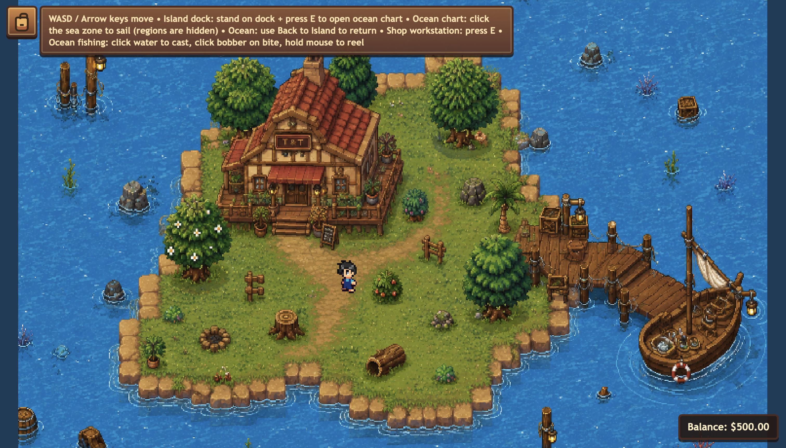
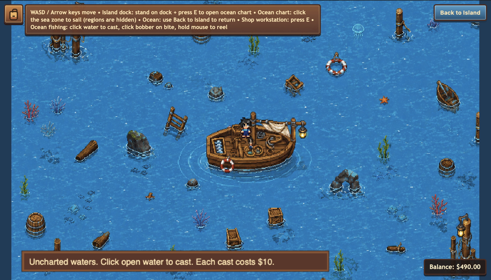
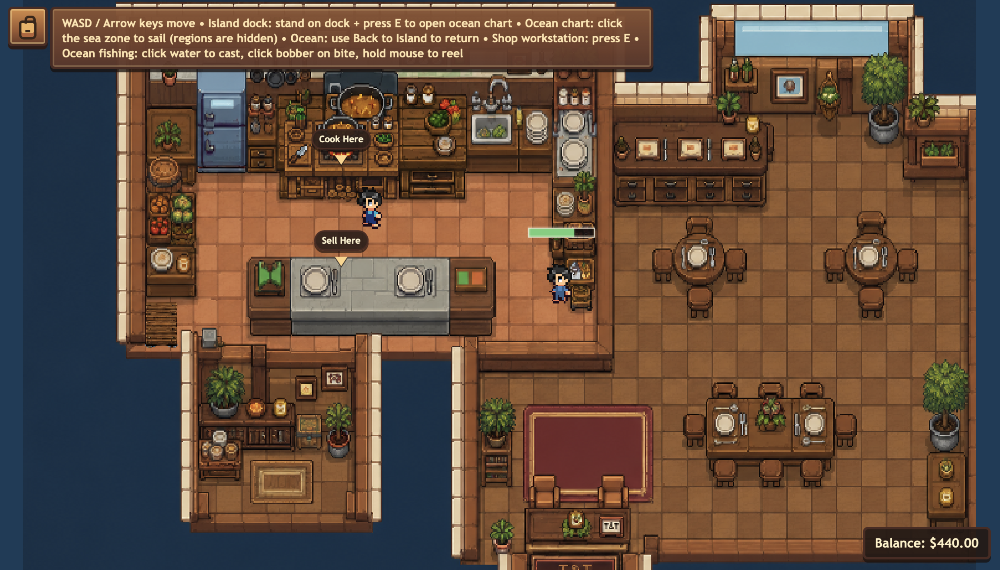
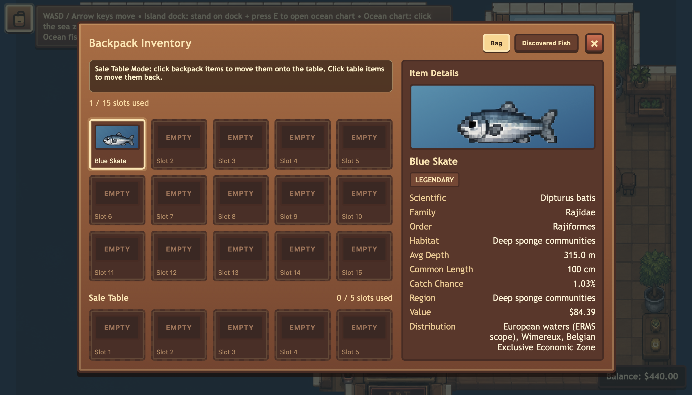

# 🌊 Tide & Till

Welcome to **Tide & Till**, a cozy pixel-art simulation game where you manage a coastal life of fishing, cooking, and commerce. Built with a focus on high-fidelity pixel aesthetics and a warm, rustic user interface.

**🔗 Devpost:** https://devpost.com/software/tide-and-till

**🎥 Demo Video:** https://youtu.be/usHPEN28OWc


## 🎮 Game Overview

In this sandbox experience, you play as a coastal entrepreneur. Explore the waters, catch rare fish, master the culinary arts through an extensive recipe book, and manage your growing economy.

## 📸 Screenshots






### Key Features

*   **Dynamic Fishing System**: Catch various aquatic life ranging from `Common` to `Legendary` rarities, each featuring unique pixel-art sprites.
*   **Culinary Arts**: A detailed **Recipe Book** allows you to discover and cook complex dishes using your catches.
*   **Inventory Management**: A robust, tabbed inventory system to organize your resources, equipment, and prepared meals.
*   **Live Economy**: Track your earnings with a real-time economy HUD featuring visual feedback for profit and expenses.
*   **Pixel-Perfect UI**: A custom-themed interface utilizing a "Wood & Paper" aesthetic, designed for clarity and immersion.

## 🛠 Technical Stack

*   **Frontend**: HTML5, CSS3 (Custom Properties / Flexbox / Grid)
*   **Rendering**: HTML5 Canvas with pixel-perfect scaling (`image-rendering: pixelated`)
*   **Architecture**: Vanilla JavaScript / Fullstack Sandbox

## 🎨 Visual Identity

The project uses a dedicated color palette defined in `styles.css`:
- **Wood & Earth**: Deep browns (`--wood-deep`) and warm ambers (`--border`).
- **Nautical**: Sea blues (`--sea`) and cream accents (`--cream`).
- **Paper**: Aged parchment textures for menus (`--paper`).

## ⌨️ Controls

| Action | Key/Input |
| :--- | :--- |
| **Move NPC/Player** | W/A/S/D |
| **Open Inventory** | `B` or Backpack Button |
| **Open Recipe Book** | Interaction with Workstation |
| **Return to Sea** | Navigation Button |
| **Debug Menu** | Toggleable Overlay |

## 🚀 Getting Started

1.  **Clone the repository**:
    ```bash
    git clone [repository-url]
    ```
2.  **Open the project**:
    Simply open `index.html` in your browser or use a local live server extension.

3.  **Development**:
    The core styling is located in `/styles.css`. Global scaling is handled via the `--global-scale` variable to ensure the pixel art remains crisp on all displays.

## 📝 Development Notes

*   **Responsive Design**: The UI is optimized for various screen sizes, with specific media queries for mobile-friendly inventory and recipe layouts.
*   **Animations**: Custom keyframes handle "bobbing" world markers and smooth economic UI transitions.
*   **Debugging**: A built-in debug overlay provides real-time status readouts for game state monitoring.

---
*Built with 💙 in the Sandbox.*
